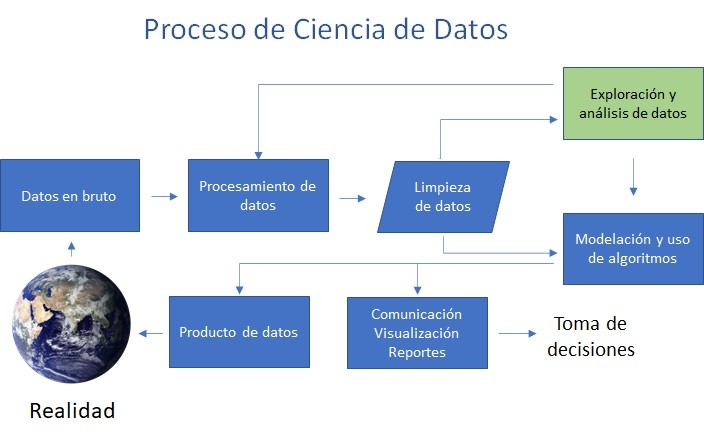

# 3. Ciencia de Datos

## Proceso de Ciencia de Datos

[Data Science: ¿Cómo trabajar la data para que aporte valor al negocio?](https://www.linkedin.com/pulse/data-science-c%C3%B3mo-trabajar-la-para-que-aporte-valor-al-gac-pabst/)
