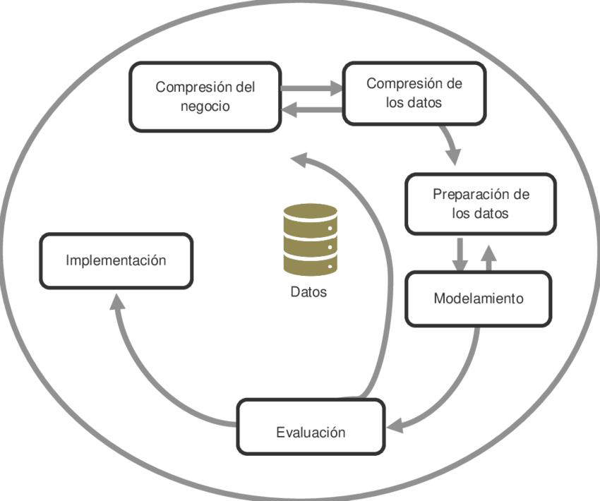
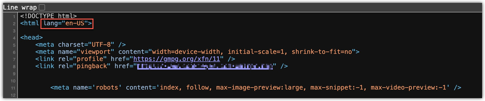
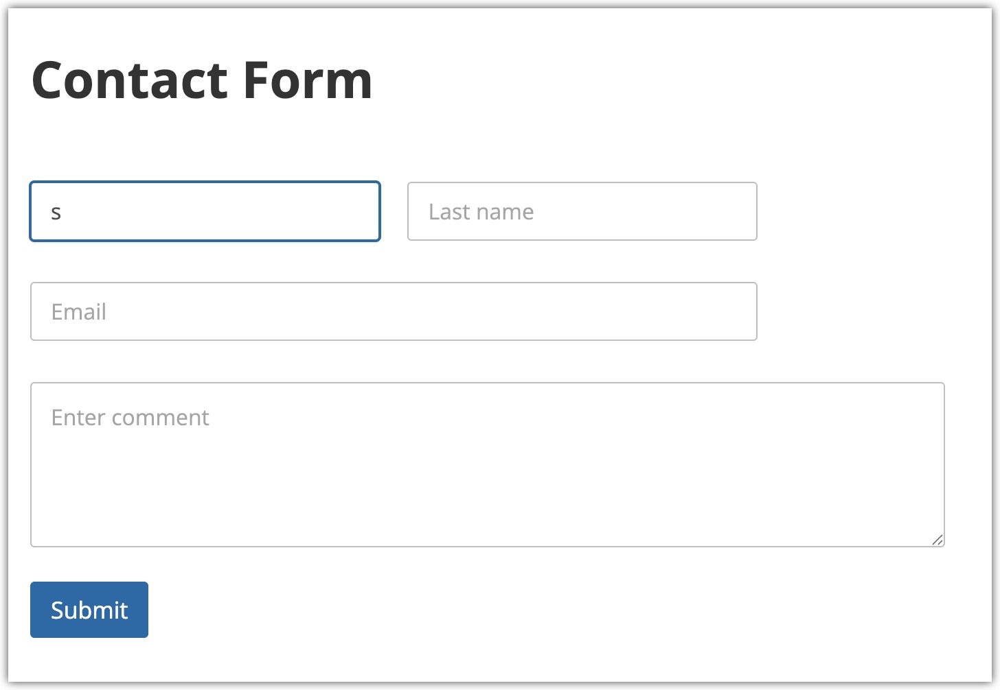
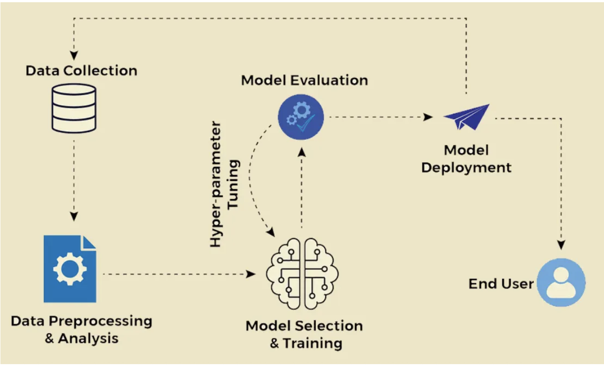

# 3 Ciencia de Datos

## 3.1 Introducción

* La **ciencia de datos** se ha consolidado como un campo interdisciplinario que combina estadística, informática y conocimiento del dominio para extraer valor de grandes volúmenes de información.
* Su relevancia radica en la capacidad de transformar datos en conocimiento accionable, apoyando la toma de decisiones en ámbitos tan diversos como la salud, la educación, la economía y la accesibilidad digital (Provost & Fawcett, 2013).

## 3.2 Proceso de Ciencia de Datos

El ciclo de vida de un proyecto de ciencia de datos se organiza en etapas iterativas que garantizan rigor metodológico, reproducibilidad y valor práctico. Una de las metodologías más reconocidas es CRISP-DM (Cross Industry Standard Process for Data Mining), que establece un marco sistemático para abordar problemas complejos (Chapman et al., 2000).

1. **Comprensión del negocio**:
    * Definir claramente el problema y los objetivos del proyecto.
    * Identificar las preguntas de investigación o necesidades de la organización.
2. **Comprensión de los datos**:
    * Recolectar datos de diversas fuentes (bases de datos, APIs, archivos, web scraping).
    * Explorar su estructura, calidad y relevancia.
    * Detectar inconsistencias, valores faltantes y sesgos.
3. **Preparación de los datos**:
    * Limpieza: tratamiento de valores nulos, duplicados y errores.
    * Transformación: normalización, codificación de variables categóricas, reducción de dimensionalidad.
    * Integración: combinar múltiples fuentes en un dataset coherente.
4. **Modelado**:
    * Selección de algoritmos de machine learning adecuados (regresión logística, árboles de decisión, SVM, redes neuronales).
    * Entrenamiento del modelo con datos de entrenamiento.
    * Ajuste de hiperparámetros para optimizar el rendimiento.
5. **Evaluación**:
    * Validar el modelo con datos de prueba.
    * Medir desempeño con métricas específicas:
        * Accuracy: proporción de predicciones correctas.
        * Precision y Recall: equilibrio entre falsos positivos y falsos negativos.
        * F1-score: media armónica de precisión y recall.
        * ROC-AUC: capacidad de discriminación global.
    * Comparar modelos y seleccionar el más adecuado.
6. **Implementación**:
    * Desplegar el modelo en un entorno real (aplicación, API, dashboard).
    * Integrar con procesos de negocio o sistemas existentes.
7. **Monitoreo y mantenimiento**:
    * Supervisar el rendimiento del modelo en producción.
    * Detectar degradación por cambios en los datos (concept drift).
    * Actualizar y reentrenar periódicamente para mantener la eficacia.



| Etapa                    | Objetivo                     | Ejemplo aplicado                      |
| --                       | --                           | --                                    |
| Comprensión del negocio  | Definir problema y objetivos | Evaluar accesibilidad web             |
| Comprensión de los datos | Explorar fuentes y calidad  | Dataset de páginas con etiquetas      |
| Preparación              | Limpiar y transformar        | Codificación binaria de accesibilidad |
| Modelado                 | Entrenar algoritmos          | Regresión logística, SVM              |
| Evaluación               | Medir desempeño              | Accuracy, F1-score                    |
| Implementación           | Desplegar modelo             | API de evaluación automática          |
| Monitoreo                | Mantener rendimiento         | Reentrenar con nuevos datos           |

### 3.2.1 Comprensión del negocio

* Este trabajo final integrador tiene como objetivo general "Desarrollar un modelo de aprendizaje automático que clasifique páginas web según problemas de accesibilidad, para promover la inclusión digital y detectar  barreras que afectan a personas con discapacidad".
* La accesibilidad web garantiza que todos puedan acceder y utilizar el contenido digital por igual. Crea una experiencia en línea más justa e inclusiva, donde nadie queda excluido y todos pueden interactuar con la web con facilidad y confianza.
* Se seleccionaron los seis problemas de accesibilidad web más comunes en 2025, según los resultados del estudio WebAIM Million, que analiza un millón de páginas de inicio cada año (WebAIM, 2025):
  * Páginas a las que les falta el atributo de idioma  
  * Imágenes sin texto alternativo
  * Formularios sin etiquetas
  * Botones con etiquetas faltantes o poco claras
  * Enlaces con texto faltante o poco claro
  * Contraste de color insuficiente entre el texto y el fondo

#### 3.2.1.1 Páginas a las que les falta el atributo de idioma

* El atributo de **lang** indica a los navegadores y lectores de pantalla en qué idioma está escrita la página.
* Cuando el atributo **lang** falta en el HTML, las tecnologías de asistencia deben "adivinar" el idioma. Esto suele provocar una pronunciación incorrecta y una lectura confusa.
* Ejemplo de una página HTML con un atributo **lang** correctamente definido (lang="en-US") en la etiqueta.

    

* **A quién afecta**:
  * Usuarios de lectores de pantalla.
  * Personas que no hablan el idioma del sitio web.
  * Cualquiera que confíe en una pronunciación correcta o en herramientas de traducción.

* **Cómo corregir el atributo lang faltante**: establecer el idioma correcto en cada página para que los navegadores y lectores de pantalla sepan leer el contenido. Los desarrolladores deben agregar el atributo **lang** a la etiqueta **\<html>** en la página principal. Por ejemplo:

    ```html
    <html lang="en">
    ```

* Si una página o sección usa un idioma diferente, se debe cambiar el valor del atributo **lang** para toda la página o se debe agregar un atributo **lang** a esa sección específica. Esto ayuda a las herramientas de asistencia a pronunciar las palabras correctamente y mejora la comprensión.

#### 3.2.1.2 Imágenes sin texto alternativo

* El texto alternativo es una breve descripción que comunica el contenido de una imagen a los usuarios que no pueden verla. Sin texto alternativo, los lectores de pantalla solo anuncian el elemento como "imagen", sin ninguna descripción de lo que representa, lo que impide que los usuarios accedan a información importante.

* **A quién afecta**:
  * Usuarios ciegos.
  * Usuarios con baja visión que dependen de lectores de pantalla.
  * Personas en redes lentas o inestables cuando las imágenes no se cargan.

* **Cómo corregir el texto alternativo faltante**: asegurarse de que cada imagen significativa tenga un texto alternativo preciso. Se debe escribir un texto breve que describa el propósito de la imagen y agregarlo al atributo **alt** en el HTML. Por ejemplo:

    ```html
    
    ```

* Las imágenes decorativas deben usar un atributo alt vacío ( alt="") para que los lectores de pantalla las omitan. Para elementos visuales complejos, como gráficos o diagramas, se debe incluir un texto alternativo breve y proporcionar una explicación más extensa cerca o un enlace a una descripción larga y accesible.

#### 3.2.1.3 Formularios sin etiquetas

* Una etiqueta conecta texto descriptivo (como "Correo electrónico" o "Contraseña") con su campo de entrada correspondiente en un formulario.
* Sin esta conexión, los lectores de pantalla no pueden indicar correctamente lo que el usuario debe escribir en el campo, lo que lo obliga a adivinar o abandonar el formulario.
* Ejemplo: un formulario que utiliza marcadores de posición en lugar de etiquetas visibles, lo que genera problemas de accesibilidad. Como puede ver, el texto del marcador de posición "Nombre" desaparece en cuanto el usuario empieza a escribir su nombre.

    

* **A quién afecta**:
  * Usuarios de lectores de pantalla.
  * Usuarios navegando con entrada de voz.
  * Usuarios con desafíos cognitivos que necesitan una orientación clara.

* **Cómo corregir las etiquetas de formulario faltantes**: asegurarse de que cada campo de formulario tenga una etiqueta clara y vincule la etiqueta a su entrada mediante coincidencias atributos **for** y **id** para que las herramientas de asistencia puedan leerla correctamente. Por ejemplo:

    ```html
    <label for="email">Email address</label> 
    <input type="email" id="email" name="email">
    ```

* Se debe evitar confiar únicamente en el texto del marcador de posición, ya que los lectores de pantalla suelen ignorarlo y desaparece en cuanto el usuario empieza a escribir. Si el campo requiere información específica, como un formato o un ejemplo, agregue esas instrucciones en la etiqueta o cerca de ella para que todos los usuarios comprendan el requisito.

#### 3.2.1.4 Botones con etiquetas faltantes o poco claras

* Los botones vacíos son botones que no tienen texto visible ni nombre accesible. Esto suele ocurrir cuando un botón solo usa un icono sin texto alternativo, lo que lo hace prácticamente vacío para los lectores de pantalla; simplemente lo anunciarán como "botón", lo cual no explica la acción. Aquí hay un ejemplo de un código vacío:

    ```html
    <button></button>
    ```

* **A quién afecta**:
  * Usuarios de lectores de pantalla.
  * Usuarios del teclado.
  * Usuarios con dificultades motoras o cognitivas.
  * Todos los usuarios del sitio web.

* **Cómo arreglar botones vacíos**: los botones siempre deben indicar a los usuarios qué acción activan. Se debe usar etiquetas cortas y claras como "Buscar", "Enviar" o "Agregar al carrito" para que el propósito sea fácil de entender. Asegurarse de que esta etiqueta se incluya en el HTML para que las herramientas de asistencia puedan leerla. Por ejemplo:

    ```html
    <button>Search</button>
    ```

#### 3.2.1.5 Enlaces con texto faltante o poco claro

* Los enlaces vacíos son enlaces sin texto visible ni nombre accesible. Esto suele ocurrir cuando un enlace solo usa un icono sin texto alternativo significativo, o cuando el texto del enlace se omite accidentalmente. Sin etiqueta, los lectores de pantalla lo anuncian simplemente como "enlace". A continuación se muestra un ejemplo de un enlace vacío:

    ```html
    <!-- This link has no visible text and no accessible name --> 
    <a href="/pricing"> 
         <!-- No meaningful alt text --> 
    </a>
    ```

* **A quién afecta**:
  * Usuarios de lectores de pantalla.
  * Usuarios del teclado que navegan a través de enlaces.
  * Usuarios con desafíos cognitivos.

* **Cómo arreglar enlaces vacíos**: asegurarse de que cada enlace tenga texto visible o un nombre accesible para que los usuarios y los lectores de pantalla comprendan su propósito. Por ejemplo:

    ```html
    <a href="/pricing">View pricing</a>
    ```

* Nota: Si el  enlace tiene texto, pero es impreciso (como "Haga clic aquí" o "Leer más"), se debe considerar reemplazarlo con un texto más claro como "Ver precios" o "Descargar informe".

#### 3.2.1.6 Contraste de color insuficiente entre el texto y el fondo

* El contraste de color mide la diferencia de luminancia o brillo percibido entre dos colores.
* Un contraste de color insuficiente se produce cuando el texto no destaca lo suficiente del fondo, lo que dificulta su visibilidad y aún más su lectura. Un ejemplo común es el texto gris claro sobre un fondo blanco. Puede parecer limpio, pero crea un claro problema de contraste.
* Un ejemplo de una página con bajo contraste de color, lo que dificulta la lectura del texto:

    

* **A quién afecta**:
  * Personas con baja visión.
  * Personas con daltonismo.
  * Adultos mayores con sensibilidad al contraste reducida.
  * Personas intentando leer contenido bajo la luz solar directa.

* **Cómo solucionar el contraste de color insuficiente**: su objetivo es cumplir con las relaciones de contraste WCAG: 4,5:1 para texto normal (cualquier tamaño inferior a 18 puntos o inferior a 14 puntos en negrita) y 3:1 para texto grande (es de 18 puntos o más o de 14 puntos o más en negrita). Se debe ajustar la paleta de colores para que todos los elementos clave cumplan con las relaciones de contraste requeridas, no solo el texto de fondo. Esto incluye enlaces, botones, indicadores de enfoque, iconos, bordes de campos de formulario y cualquier otro elemento visual que los usuarios necesiten ver con claridad.
* Se debe probar los colores con herramientas como el [Verificador de Contraste de Color de WebAIM](https://webaim.org/resources/contrastchecker/). Si un par de colores falla, ajustar oscureciendo o aclarando el texto o el fondo, o eligiendo un color completamente diferente hasta que el contraste cumpla con los requisitos WCAG y el contenido sea legible.

### 3.2.2 Comprensión de los datos

* Los datos son lo que permite a las máquinas reconocer patrones, hacer predicciones y mejorar con el tiempo. El tipo, la estructura y la calidad de los datos afectan directamente el rendimiento de un modelo de aprendizaje automático. Para construir un modelo de aprendizaje automático potente, primero se debe comprender y preparar los datos cuidadosamente.

* **Recolección de datos**: es el proceso sistemático de recopilar, medir y obtener información de diversas fuentes (sensores, encuestas, sitios web, APIs, transacciones) para responder preguntas, probar hipótesis y fundamentar decisiones, involucrando métodos manuales y automatizados para generar conocimiento y valor, siendo crucial para la inteligencia empresarial y el análisis
  
  * En este trabajo, la recolección de datos se hace mediante el método de web scraping, ya que se extrajeron los nombres y urls de las instituciones universitarias argentinas del sitio: [Listado Instituciones Universitarias](https://guiadecarreras.siu.edu.ar/ciie_ofertas/2.0/listado_instituciones.php). Una vez obtenidos esos datos, se procede para cada url:
      1. navegar a la página web "home"
      2. identificar la estructura sintáctica
      3. extraer información
      4. verificar barreras
      5. contabilizar casos de éxitos y de fallos

* **Comprensión del dataset**: es una colección de puntos de datos (a menudo almacenados en formato de tabla) que se utiliza para entrenar, validar o probar un modelo de aprendizaje automático. Cada fila de un conjunto de datos representa una instancia u observación única, mientras que cada columna contiene una característica o atributo específico de esa instancia.
  * En este trabajo, cada fila representa el análisis de accesibilidad web (cantidad de éxitos y fallos de los 6 problemas de accesibilidad web más comunes en 2025) de las instituciones universitarias de la República Argentina.

* **Estructuras de datos en el aprendizaje automático**: los datos vienen en muchas formas y la estructura de los datos puede variar ampliamente según la tarea:
  * **Datos tabulares**: los datos estructurados en filas y columnas (como hojas de cálculo) son el formato más común. Estos datos son fáciles de manejar en aprendizaje automático, ya que cada columna se puede considerar como una característica.
  * **Datos de series temporales**: datos recopilados a intervalos regulares (como precios de acciones o datos meteorológicos). Cada intervalo de tiempo es un punto de datos, lo que facilita la realización de predicciones basadas en tendencias pasadas.
  * **Datos de texto**: incluye documentos, mensajes y otros formatos escritos. El texto debe transformarse en representaciones numéricas (como recuentos de palabras o incrustaciones) para su uso en aprendizaje automático.
  * **Datos de imagen**: datos en forma de imágenes o vídeos. Los datos de imagen requieren técnicas especializadas para su procesamiento y comprensión, como las redes neuronales convolucionales.

### 3.2.3 Preparación de los datos

* El objetivo de la preparación de datos es garantizar que estén limpios, estructurados y listos para el aprendizaje.

* **Análisis Exploratorio de Datos (EDA)**: implica una combinación de herramientas estadísticas, técnicas de visualización y, en ocasiones, un poco de intuición para descubrir la estructura de un conjunto de datos. El objetivo es comprender la composición de los datos, detectar valores atípicos o patrones inusuales y realizar observaciones iniciales que guiarán el análisis posterior. Es un paso esencial que conduce a una mejor limpieza de datos, selección de características y diseño de modelos. Pasos claves:
  * **Resumen de datos**: comprender la forma de los datos (filas y columnas), estadísticas de resumen como la media, la mediana, el mínimo y el máximo, y la distribución de cada variable.
  * **Limpieza de datos**: identificar cualquier valor faltante, duplicado o valor atípico que pueda sesgar los resultados.
  * **Análisis univariado**: examinar una variable a la vez para comprender su distribución y características clave (por ejemplo, asimetría, modalidad).
  * **Análisis bivariado/multivariado**: analizar las relaciones entre dos o más variables, lo que puede revelar dependencias y correlaciones.
  * **Visualización**: utilizar gráficos para que la información obtenida de los datos sea más accesible y visualmente atractiva.

* **Limpieza de datos**: es el proceso de preparar los datos sin procesar para que sean consistentes y estén libres de errores. Los datos desordenados pueden deberse a diversos problemas: valores faltantes, valores atípicos, duplicados e incluso información irrelevante. La limpieza de datos implica gestionar estos problemas para que el modelo pueda aprender eficazmente. Los pasos comunes de la limpieza de datos son:
  * **Eliminación de duplicados**: las filas duplicadas pueden sesgar los resultados al enfatizar demasiado puntos de datos específicos, por lo que normalmente se eliminan.
  * **Manejo de valores faltantes**: los valores faltantes se pueden completar (imputar) con la media, la mediana o una métrica similar, o las filas con datos faltantes se pueden eliminar por completo.
  * **Detección de valores atípicos**: Los valores atípicos son valores inusuales que se encuentran muy alejados de la mayoría de los puntos de datos. Si bien algunos valores atípicos son útiles, otros pueden interrumpir el aprendizaje. Estos valores pueden limitarse o eliminarse.
  * **Conversión de tipos de datos**: los formatos inconsistentes, como las fechas almacenadas como texto, deben convertirse en tipos utilizables.

* **Preprocesamiento de dato**: prepara los datos sin procesar para el modelado. Sin datos bien preprocesados, incluso los mejores algoritmos pueden producir resultados deficientes, ya que los datos sin procesar suelen contener inconsistencias, ruido y escalas variables que dificultan la generalización de los modelos. Existen tres técnicas esenciales de preprocesamiento que ayudan a que los modelos aprendan con mayor eficacia, mejoren la precisión y aumenten la interpretabilidad:
  * **Normalización**: escala las características para que se encuentren dentro de un rango específico, generalmente de 0 a 1. Es especialmente útil al utilizar modelos sensibles a la magnitud de los datos, como algoritmos basados en la distancia. Es útil cuando se conocen los límites mínimos y máximos de los datos, o cuando se trata con algoritmos sensibles a las magnitudes de los datos.

  $$X_{norm} = \dfrac{X - X_{min}}{X_{max} - X_{min}}$$

  * **Estandarización**: transforma los datos para que tengan una media de 0 y una desviación estándar de 1. A diferencia de la normalización, que está limitada a un rango específico, la estandarización reconfigura la distribución de los datos alrededor de cero, lo que la hace adecuada para datos sin límites predefinidos. Es beneficiosa para los datos que tienen una distribución gaussiana (normal) y se aplica comúnmente en algoritmos que suponen normalidad, como la regresión lineal, la regresión logística y las redes neuronales.
  
  $$X_{std} = \dfrac{X - mean(X)}{std(X)}$$
  
  * **Codificación One-Hot**: crea una columna binaria para cada categoría, donde un "1" representa la presencia de dicha categoría. Resulta útil para datos categóricos desordenados.
  * **Codificación de etiquetas**: asigna a cada categoría un entero único. Sin embargo, solo es adecuado cuando existe un orden significativo en las categorías (como bajo, medio, alto).

* **Feature engineering**: en el aprendizaje automático, las características (las columnas o atributos del dataset) representan la materia prima para realizar predicciones. Sin embargo, no todas las características son iguales, y algunas pueden agregar ruido o complejidad sin ofrecer mucho poder predictivo. La ingeniería de características: ayuda a refinar, seleccionar e incluso crear nuevas características para mejorar el rendimiento del modelo. Las siguientes técnicas garantizan que el modelo se centre en la información relevante, lo que lo hace más rápido y preciso:
  * **Selección de características**: implica elegir las más importantes para el modelo. Al reducir los datos irrelevantes o redundantes, se minimiza el sobreajuste, se simplifica el modelo y se mejora la interpretabilidad.
  * **Extracción de características**: crea nuevas características o transforma las existentes. Esta técnica es valiosa cuando las características originales no son directamente útiles, pero pueden reconfigurarse para obtener información valiosa.

### 3.2.4 Modelado

* El aprendizaje automático es una rama de la inteligencia artificial que permite a los sistemas aprender de los datos, tomar decisiones y mejorar con el tiempo sin necesidad de programación explícita.
* En lugar de que se les indique exactamente cómo resolver un problema, los algoritmos de aprendizaje automático analizan patrones en los datos para identificar la mejor manera de alcanzar una solución.

* Existen tres tipos principales de aprendizaje automático:
  * **aprendizaje supervisado**:  el algoritmo aprende de un conjunto de datos etiquetado, lo que significa que cada punto de datos está etiquetado con la respuesta correcta. El algoritmo utiliza esta información para realizar predicciones sobre datos nuevos e inéditos.
  * **aprendizaje no supervisado**:  el algoritmo trabaja con datos sin etiquetar, lo que significa que no hay orientación sobre la respuesta "correcta". En cambio, debe encontrar patrones, correlaciones o grupos ocultos en los datos. Se utilizan en tareas como la agrupación (agrupación de elementos similares) y la detección de anomalías (localización de puntos de datos inusuales).
  * **aprendizaje por refuerzo**: se aprende por ensayo y error. En este método, un algoritmo aprende a alcanzar un objetivo realizando acciones en un entorno y recibiendo retroalimentación sobre dichas acciones. La retroalimentación positiva (recompensas) refuerza el buen comportamiento, mientras que la retroalimentación negativa (castigos) desalienta los errores.

* El aprendizaje automático está transformando industrias a nivel mundial. Estas son algunas áreas clave donde el aprendizaje automático está marcando la diferencia:
  * **Salud**: el aprendizaje automático ayuda a diagnosticar enfermedades mediante el análisis de datos de pacientes, imágenes médicas e historiales clínicos.
  * **Finanzas**: los bancos y las instituciones financieras utilizan algoritmos de aprendizaje automático para detectar fraudes, gestionar riesgos e incluso automatizar decisiones comerciales.
  * **Comercio minorista**: desde recomendaciones personalizadas de productos hasta la gestión de inventario, el aprendizaje automático está transformando la experiencia de compra.
  * **Agricultura**: los algoritmos analizan las condiciones del suelo, los datos meteorológicos y los patrones históricos de los cultivos para ofrecer recomendaciones sobre la selección, la siembra y la época de cosecha de los cultivos.

* Hay muchos ejemplos en los que se utiliza ML para facilitar la toma de decisiones.

* En este trabajo se utilizará el aprendizaje supervisado, ya que cada observación está etiquetada con la respuesta correcta: "sin_prob_accesibilidad" o "con_prob_accesibilidad".

* En el aprendizaje automático, la **clasificación binaria** es un algoritmo de aprendizaje supervisado que categoriza las nuevas observaciones en una de dos clases.

* Las siguientes son algunas aplicaciones de clasificación binaria, donde las columnas 0 y 1 son dos clases posibles para cada observación:

| Aplicación                     | Observación             | 0            | 1            |
| --                             | --                      | --           | --           |
| Diagnóstico médico.            | Paciente                | Saludable    | Enfermo      |
| Análisis de correo electrónico | Correo electrónico      | No es spam   | Es spam      |
| Análisis de datos financieros  | Transacción             | No es fraude | Fraude       |
| Marketing                      | Visitante del sitio web | No compra    | Compra       |
| Clasificación de imágenes      | Imagen.                 | No gato      | Gato         |
| Análisis de accesibilidad web  | Página web              | sin_prob_acc | con_prob_acc |

* En el aprendizaje automático, muchos métodos utilizan la clasificación binaria. Los más comunes son:
  * Regresión logística
  * SVM - Máquinas de vectores de soporte
  * Random Forest
  * KNN - Vecino más cercano
  * Naive Bayes
  * Árboles de decisión

### 3.2.5 Evaluación

* Existen métricas de evaluación para los modelos de clasificación, incluyendo Accuracy (Precisión), Recall (Recuperación), F1-Score (Puntuación F1) y ROC-AUC. Estas métricas ayudan a evaluar el rendimiento del modelo, especialmente para tareas de clasificación binaria

* Para entender las métricas de Precisión y Recuperación es necesario definir los términos asociados con la **matriz de confusión**:
  * **Verdadero positivo (VP)**: el modelo predice correctamente la clase positiva.
  * **Verdadero negativo (VN)**: el modelo predice correctamente la clase negativa.
  * **Falso positivo (FP)**: el modelo predice incorrectamente la clase positiva (también conocido como error tipo I).
  * **Falso negativo (FN)**: el modelo predice incorrectamente la clase negativa (error tipo II).

    | Actual/ Predicho | Positivo | Negativo |
    | --               | --       | --       |
    | Positivo         | **VP**   | **FP**   |
    | Negativo         | **FN**   | **VN**   |

**Accuracy (Precisión)**:

* La precisión responde a la pregunta: Cuando el modelo predice un resultado positivo, ¿con qué frecuencia es correcto?

$$Accuracy = \dfrac{VP}{VP + FP}$$

* **Alta precisión** significa pocos falsos positivos.
* Se utiliza cuando se quiere minimizar los falsos positivos, como en la detección de spam (no se quiere marcar correos electrónicos que no son spam como spam).

**Recall (Recuperación)**:

* Respuestas de recuperación: Cuando el resultado real es positivo, ¿con qué frecuencia el modelo lo predice correctamente?

$$Recall = \dfrac{VP}{VP + FN}$$

* **Un alto nivel de recuperación** significa pocos falsos negativos.
* Se utiliza cuando pasar por alto casos positivos resulta costoso, como en la detección de fraudes (no se quiere pasar por alto ningún caso de fraude).

**F1-Score (Puntuación F1)**:

* La puntuación F1 combina la precisión y la recuperación en una sola métrica calculando su media armónica. Resulta especialmente útil cuando se busca un equilibrio entre precisión y recuperación.

$$F1-Score = 2 * \dfrac{Accuracy * Recall}{Accuracy + Recall}$$

* ***Una puntuación F1 alta** indica un buen equilibrio entre precisión y recuperación.
* Esta métrica es beneficiosa en escenarios donde tanto los falsos positivos como los falsos negativos tienen costos, como en la detección de spam o de fraude.

**Curva ROC y AUC**:

* La curva **ROC (característica operativa del receptor)** visualiza el rendimiento del modelo en diferentes umbrales, trazando la tasa de positivos verdaderos (TPR) frente a la tasa de positivos falsos (FPR).
* El **AUC representa el área bajo la curva ROC** y proporciona un valor único para evaluar la capacidad del modelo para distinguir entre clases. Cuanto más cercano esté el AUC a 1, mejor será el rendimiento del modelo en todos los umbrales.
  * AUC = 1 : clasificador perfecto.
  * AUC = 0,5 : el modelo no funciona mejor que una suposición aleatoria.

### 3.2.6 Implementación

* Implementar un modelo significa ponerlo a disposición para predicciones en tiempo real o procesamiento por lotes mediante una API.
* El servicio de modelos es el proceso de hacer que un modelo de aprendizaje automático entrenado sea accesible para la inferencia en un entorno de producción. Esto puede hacerse de varias maneras:
  * **Predicciones en tiempo real**: las API reciben información, la pasan al modelo y devuelven predicciones instantáneamente.
  * **Procesamiento por lotes**: grandes conjuntos de datos se procesan de una sola vez, generando predicciones para todas las entradas.
  * **Transmisión de datos**: las predicciones se realizan como flujos de datos, adecuados para IoT o monitoreo en tiempo real.



* Las API (Interfaces de Programación de Aplicaciones) son el puente entre el modelo y la aplicación del usuario final. Ofrecen:
  * **Escalabilidad**: maneja múltiples solicitudes simultáneamente.
  * **Interoperabilidad**: ofrece predicciones para aplicaciones web, móviles o de escritorio.
  * **Facilidad de uso**: los desarrolladores pueden integrar modelos en sus flujos de trabajo sin profundizar en los detalles de ML.

* Pasos:
  1. Guardar el modelo
  2. Crear una API con un framework, por ejemplo, Flask o FastAPI para Python
  3. Probar la API, mediante herramientas como Postman o cURL

## 3.3 Flujo de Trabajo

* Es la creación de un **pipeline de predicción** para que el modelo entrenado sea accesible a través de una aplicación web.
* El objetivo del pipeline es:
  1. Tomar la entrada del usuario a través de un formulario web
  2. Preprocesar los datos de entrada
  3. Cargar el modelo entrenado
  4. Hacer predicciones utilizando los datos de entrada
  5. Mostrar los resultados en la aplicación web

### 3.3.1 Descripción general del pipeline de predicción

* **Paso 1: Configuración de la aplicación Flask**: Flask es un framework web de Python que permite definir rutas (URL) y gestionar las solicitudes de los usuarios. Las rutas definen cómo interactúan los usuarios con la aplicación web:
  * **Página de inicio**: muestra el formulario de entrada
  * **Punto final de predicción**: maneja los envíos de los usuarios y proporciona predicciones.

* **Paso 2: Capturar la entrada del usuario**: el formulario de entrada se encuentra por ejemplo dentro del archivo **index.html** donde los usuarios introducen los datos. El formulario captura las siguientes características:
  * doc_language_ok, alt_texts_ok, input_labels_ok, empty_buttons_ok, empty_links_ok, color_contrast_ok
  * doc_language_fail, alt_texts_fail, input_labels_fail, empty_buttons_fail, empty_links_fail, color_contrast_fail

* **Paso 3: Creación del proceso de predicción**: la lógica de predicción está dada por la carga del modelo entrenado, captura de los datos del formulario, aplicación de transformaciones a los datos de entrada y hacer las predicciones

* **Paso 4: Visualización de los resultados**: una vez realizadas las predicciones, los resultados se muestran en la **página de inicio** utilizando placeholders en el archivo HTML.

## Conclusión

* La ciencia de datos ofrece un marco metodológico robusto para abordar problemas complejos mediante el análisis de datos. La clasificación binaria, como técnica de machine learning, constituye una herramienta fundamental para tareas de predicción y evaluación, incluyendo la automatización de procesos de accesibilidad web. Este capítulo establece las bases conceptuales que sustentan la propuesta de este trabajo final, integrando rigor estadístico, metodológico y tecnológico aprendido en la carrera de Especialización en Ciencia de Datos de la Universidad Nacional del Oeste.

## Bibliografía

* Chapman, P., et al. (2000). CRISP-DM 1.0: Step-by-step data mining guide. SPSS Inc.
* Provost, F., & Fawcett, T. (2013). Data Science for Business. O’Reilly Media.
* Hastie, T., Tibshirani, R., & Friedman, J. (2009). The Elements of Statistical Learning. Springer.
* Witten, I. H., Frank, E., & Hall, M. A. (2016). Data Mining: Practical Machine Learning Tools and Techniques. Morgan Kaufmann.

[Data Science: ¿Cómo trabajar la data para que aporte valor al negocio?](https://www.linkedin.com/pulse/data-science-c%C3%B3mo-trabajar-la-para-que-aporte-valor-al-gac-pabst/)
